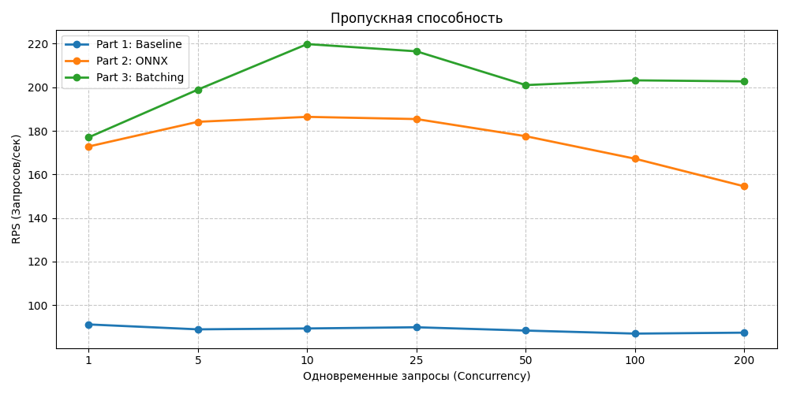
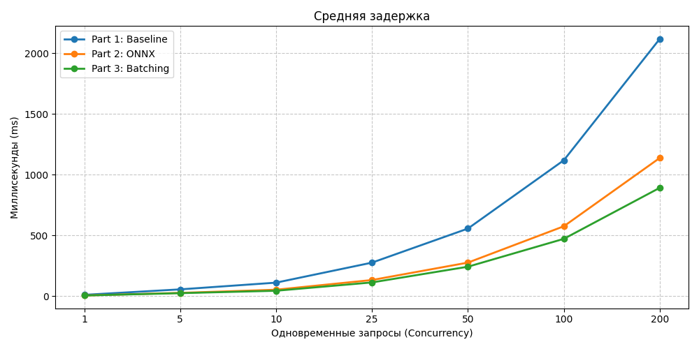
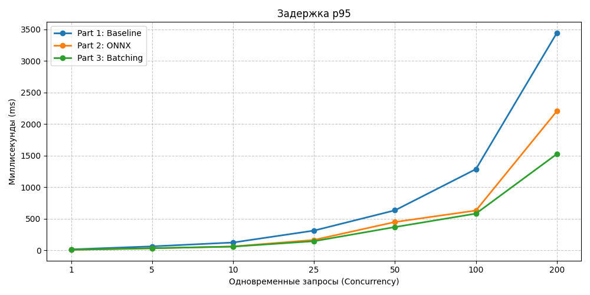
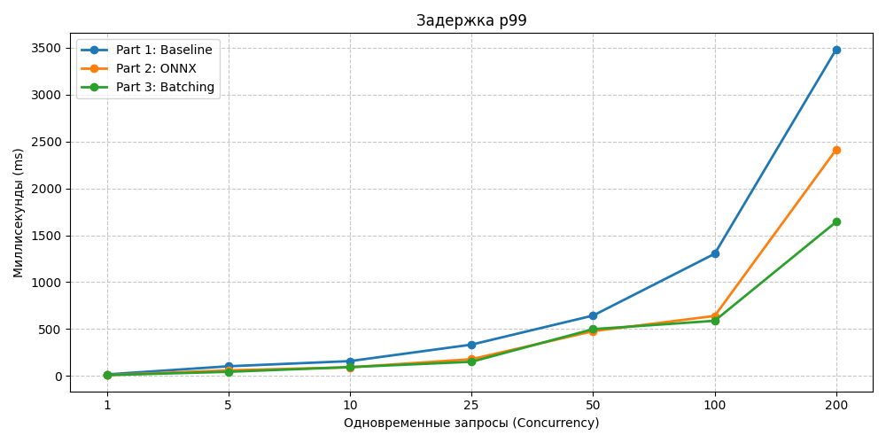
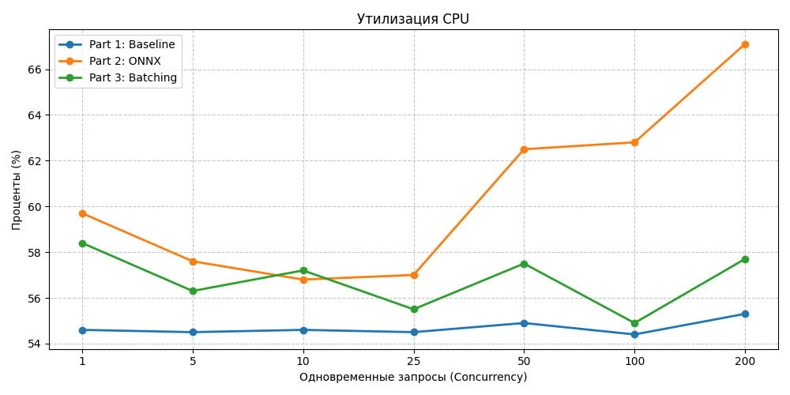

# Отчет по домашнему заданию: Оптимизация Inference Pipeline

Модель: rubert-mini-frida  
Инфраструктура: Локальная машина(CPU)

## 1. Бенчмарк и метрики

В данной работе использовалась генерация нагрузки через ограничение числа одновременных запросов. Это позволяет спокойно найти максимальную пропускную способность и выявить точку в которой сервис начинает ломаться. В реальных условиях реального деградация наступала бы значительно резче из-за бесконтрольного роста очереди входящих соединений.

Были выбраны следующие метрики:
1. Throughput (RPS): Отражает максимальную пропускную способность. 
2. Avg Latency (ms): Среднее время ответа.
3. p95 Latency (ms): Время ответа для 95% пользователей. 
4. p99 Latency (ms): Время ответа для 99% пользователей.
5. CPU Usage (%): Утилизация CPU

Они являются вполне стандартными и обще-применимыми.  

---

## 2. Эксперименты

### Часть 1: Базовый инференс
FastAPI + sentence-transformers 
Запросы обрабатываются сервером синхронно по 1 тексту за раз.

Результаты:  
Бенчмарк [Part 1: Baseline]  
concurrency=1 ...RPS: 91.2, p95: 14.0ms, CPU: 54.6%  
concurrency=5 ...RPS: 88.9, p95: 62.0ms, CPU: 54.5%  
concurrency=10 ...RPS: 89.3, p95: 123.0ms, CPU: 54.6%  
concurrency=25 ...RPS: 89.9, p95: 312.0ms, CPU: 54.5%  
concurrency=50 ...RPS: 88.3, p95: 633.1ms, CPU: 54.9%  
concurrency=100 ...RPS: 86.9, p95: 1286.0ms, CPU: 54.4%  
concurrency=200 ...RPS: 87.4, p95: 3446.1ms, CPU: 55.3%  

Бенчмарк показал классическую картину "бутылочного горлышка" синхронного инференса. 
1. Throughput уперся в жесткий потолок ~89 RPS независимо от роста нагрузки. Это физический предел скорости обработки одного текста тяжелым фреймворком.
2. Latency (p95) показала линейную деградацию: с 14 мс при 1 пользователе до 3446 мс при 200 одновременных запросах. Из-за невозможности обработать больше 89 запросов в секунду, входящие соединения копятся в очередь, многократно увеличивая время ожидания.
3. CPU Usage зафиксировался на уровне ~55%, что говорит о неэффективной утилизации процессора стандартными средствами PyTorch.

### Часть 2: Конвертация в ONNX
FastAPI + onnxruntime.  
Модель экспортирована в формат вычислительного графа ONNX.

Результаты:  
Бенчмарк [Part 2: ONNX]
concurrency=1 ...RPS: 172.8, p95: 8.0ms, CPU: 59.7%  
concurrency=5 ...RPS: 184.2, p95: 31.0ms, CPU: 57.6%  
concurrency=10 ...RPS: 186.4, p95: 60.5ms, CPU: 56.8%  
concurrency=25 ...RPS: 185.4, p95: 164.0ms, CPU: 57.0%  
concurrency=50 ...RPS: 177.5, p95: 448.0ms, CPU: 62.5%  
concurrency=100 ...RPS: 167.2, p95: 630.0ms, CPU: 62.8%  
concurrency=200 ...RPS: 154.5, p95: 2205.3ms, CPU: 67.1%  

Переход на ONNX Runtime позволил сильно ускорить вычисления за счет устранения оверхеда Python/PyTorch и оптимизации графа модели.
1. Throughput: Пропускная способность выросла более чем в 2 раза - с ~89 до ~186 RPS (на пике).
2. Latency: Из-за двукратного роста скорости вычислений, очередь стала разгребаться быстрее. Задержка p95 при 100 одновременных запросах упала с 1286 мс до 630 мс.
3. Вывод: Оптимизация самой модели дала огромный прирост, однако архитектурная проблема сервинга осталась: запросы всё еще обрабатываются по одному, из-за чего при большой нагрузке задержка всё равно уходит за 2 секунды.

### Часть 3: Динамическое батчирование
FastAPI + asyncio.Queue + Worker + onnxruntime. Запросы накапливаются в очереди(до 32 штук) в течение окна в 10 мс и отправляются в модель единым тензором.

Результаты:  
Бенчмарк [Part 3: Batching]  
concurrency=1 ...RPS: 177.0, p95: 8.0ms, CPU: 58.4%  
concurrency=5 ...RPS: 198.9, p95: 33.0ms, CPU: 56.3%  
concurrency=10 ...RPS: 219.8, p95: 58.0ms, CPU: 57.2%  
concurrency=25 ...RPS: 216.5, p95: 144.0ms, CPU: 55.5%  
concurrency=50 ...RPS: 201.0, p95: 368.0ms, CPU: 57.5%  
concurrency=100 ...RPS: 203.2, p95: 581.0ms, CPU: 54.9%  
concurrency=200 ...RPS: 202.7, p95: 1526.0ms, CPU: 57.7%  

Реализация динамического батчинга решила проблему лавинообразного роста очереди при высоких нагрузках.
1. Throughput: Пропускная способность достигла стабильных ~200-220 RPS (рост в 2.5 раза по сравнению с Baseline). 
2. Latency: Главное достижение батчинга - радикальное снижение задержек под стрессовой нагрузкой. При 200 одновременных пользователях задержка p95 составила 1526 мс(против 2205 мс в чистом ONNX и 3446 мс в Baseline). 

---

## 3. Графики

### Пропускная способность

### Задержки

### Ресурсы

---

## 4. Анализ графиков

Анализ графиков позволяет сделать два важных вывода:  

1. На графике пропускной способности отчетливо видно, что при росте нагрузки свыше 25 потоков базовая ONNX-модель (оранжевая линия) начинает деградировать (RPS падает со 186 до 154). Это связано с накладными расходами ОС на переключение контекста при поштучной обработке сотен запросов. Модель с динамическим батчингом (зеленая линия), напротив, выходит на плато (~200 RPS) и стабильно держит его при любой пиковой нагрузке.
2. При максимальной нагрузке(200 потоков) поштучный инференс ONNX потребляет ~67% CPU, в то время как батчинг - всего ~57%, выдавая при этом большую пропускную способность. Это показывает, что матричные перемножения  работают гораздо энергоэффективнее с одним сгруппированным тензором, чем с десятками одиночных матриц.